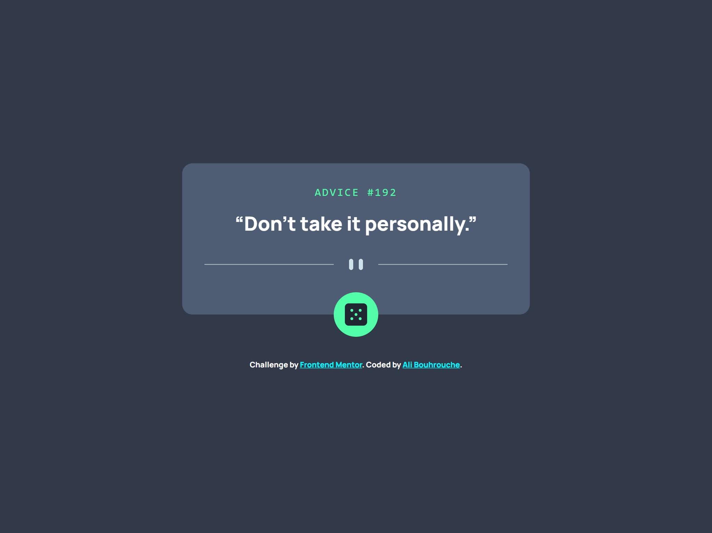

# Frontend Mentor - Advice generator app solution

This is a solution to the [Advice generator app challenge on Frontend Mentor](https://www.frontendmentor.io/challenges/advice-generator-app-QdUG-13db). Frontend Mentor challenges help you improve your coding skills by building realistic projects.

## Table of contents

- [Overview](#overview)
  - [The challenge](#the-challenge)
  - [Screenshot](#screenshot)
  - [Links](#links)
- [My process](#my-process)
  - [Built with](#built-with)
- [Author](#author)

## Overview

### The challenge

Users should be able to:

- View the optimal layout for the app depending on their device's screen size
- See hover states for all interactive elements on the page
- Generate a new piece of advice by clicking the dice icon

### Screenshot

### Links

- Solution URL: https://github.com/alibouhrouche/advice-generator-app-v1
- Live Site URL: https://alibouhrouche.github.io/advice-generator-app-v1/

## My process

### Built with

- Semantic HTML5 markup
- Flexbox
- Mobile-first workflow
- [Sass](https://sass-lang.com/)
- [Typescript](https://www.typescriptlang.org/)
- [Vite](https://vitejs.dev/)

## Author

- Website - [Ali Bouhrouche](https://ali.js.org)
- Frontend Mentor - [@alibouhrouche](https://www.frontendmentor.io/profile/alibouhrouche)
- Twitter - [@alibouhrouche](https://twitter.com/alibouhrouche)
